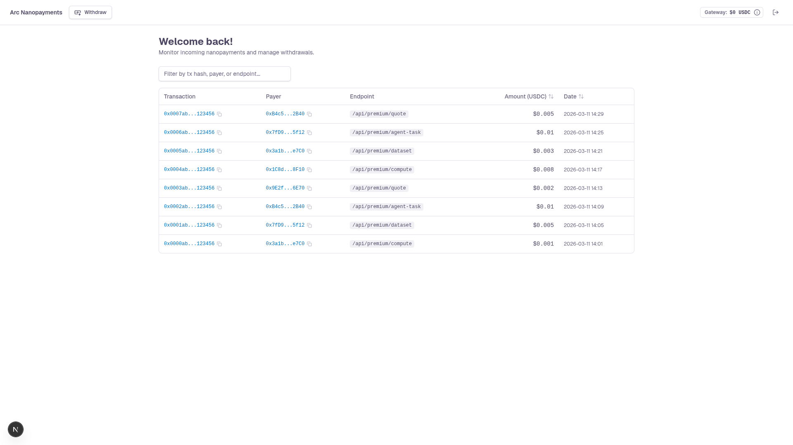

# Arc Nanopayments Demo

Demonstrate gasless USDC nanopayments using [Circle Nanopayments](https://www.circle.com/nanopayments) on Arc. A **LangChain agent** acts as the buyer, autonomously paying for paywalled resources, while a **Next.js web app** acts as the seller, exposing x402-protected endpoints and providing a seller dashboard to monitor payments and withdraw earnings.

Circle Gateway batches many signed offchain authorizations into a single onchain settlement, enabling economically viable sub-cent payments.



## Table of Contents

- [Prerequisites](#prerequisites)
- [Getting Started](#getting-started)
- [How It Works](#how-it-works)
- [Paywalled Endpoints](#paywalled-endpoints)
- [Seller Dashboard](#seller-dashboard)
- [Environment Variables](#environment-variables)
- [Demo Credentials](#demo-credentials)

## Prerequisites

- **Node.js v22+** — Install via [nvm](https://github.com/nvm-sh/nvm)
- **Supabase CLI** — Install via `npm install -g supabase` or see [Supabase CLI docs](https://supabase.com/docs/guides/cli/getting-started)
- **Docker Desktop** (only if using the local Supabase path) — [Install Docker Desktop](https://www.docker.com/products/docker-desktop/)
- *(Optional)* An **[OpenAI API key](https://platform.openai.com/api-keys)** — enables the LLM-driven payment agent. Without it, the agent runs in mock mode with scripted tool calls.

## Getting Started

1. Clone the repository and install dependencies:

   ```bash
   git clone https://github.com/akelani-circle/arc-nanopayments-demo.git
   cd arc-nanopayments-demo
   npm install
   ```

2. Set up environment variables:

   ```bash
   cp .env.example .env.local
   ```

   Then edit `.env.local` and fill in all required values (see [Environment Variables](#environment-variables) section below).

3. Generate seller and buyer wallets:

   ```bash
   npm run generate-wallets
   ```

   This creates two EVM wallets (seller and buyer) and writes the addresses and private keys to `.env.local`. Follow the on-screen instructions to fund the buyer wallet with testnet USDC via the [Circle faucet](https://faucet.circle.com/).

4. Set up the database — Choose one of the two paths below:

   <details>
   <summary><strong>Path 1: Local Supabase (Docker)</strong></summary>

   Requires Docker Desktop installed and running.

   ```bash
   npx supabase start
   npx supabase migration up
   ```

   The output of `npx supabase start` will display the Supabase URL and API keys needed for your `.env.local`.

   </details>

   <details>
   <summary><strong>Path 2: Remote Supabase (Cloud)</strong></summary>

   Requires a [Supabase](https://supabase.com/) account and project.

   ```bash
   npx supabase link --project-ref <your-project-ref>
   npx supabase db push
   ```

   Retrieve your project URL and API keys from the Supabase dashboard under **Settings > API**.

   </details>

5. Start the development server:

   ```bash
   npm run dev
   ```

   The app will be available at `http://localhost:3000`.

6. Run the AI payment agent:

   ```bash
   npm run agent
   ```

   The agent uses the buyer wallet to purchase resources from the x402-protected premium endpoints, paying with USDC on the Arc Testnet. If `OPENAI_API_KEY` is set, the agent uses the LLM to decide which tools to call; otherwise it falls back to a scripted mock run. You can optionally pass a custom query:

   ```bash
   npm run agent -- "Buy me a quote at http://localhost:3000/api/premium/quote"
   ```

   To set a USDC spending limit, use the `--limit` flag. The agent will pause when the limit is reached and prompt for additional allowance:

   ```bash
   npm run agent -- --limit 0.5
   ```

## How It Works

- Built with [Next.js](https://nextjs.org/) App Router and [Supabase](https://supabase.com/)
- Uses the [x402 protocol](https://www.x402.org/) for HTTP 402 nanopayments with USDC on the [Arc Network](https://arc.circle.com/)
- Uses [Circle's x402 batching SDK](https://www.npmjs.com/package/@circle-fin/x402-batching) (`GatewayClient`) for gasless payment facilitation
- Includes an AI payment agent built with [LangChain](https://js.langchain.com/) and [Deep Agents](https://www.npmjs.com/package/deepagents) that can check balances, deposit USDC into Gateway, verify endpoint support, and autonomously pay for x402-protected resources
- Seller dashboard with real-time payment monitoring, Gateway balance display, and cross-chain withdrawal support
- Payment events and withdrawals are persisted to Supabase with real-time subscriptions
- Styled with [Tailwind CSS](https://tailwindcss.com) and components from [shadcn/ui](https://ui.shadcn.com/)

## Paywalled Endpoints

The seller exposes several x402-protected API routes at different price points:

| Endpoint | Method | Price (USDC) | Description |
| --- | --- | --- | --- |
| `/api/premium/quote` | GET | $0.001 | Returns a premium inspirational quote |
| `/api/premium/dataset` | GET | $0.01 | Returns a small JSON analytics dataset |
| `/api/premium/compute` | POST | $0.0003 | Performs text analysis on submitted content |
| `/api/premium/agent-task` | GET | $0.03 | Returns a clue/step for a treasure hunt task |

Each endpoint returns `402 Payment Required` for unpaid requests. The buyer agent automatically signs the authorization and retries with the payment signature to receive the content.

## Seller Dashboard

The dashboard at `/dashboard` provides:

- **Gateway Balance** — Top-bar badge showing the seller's available Gateway balance, with a detail dialog for total, withdrawing, withdrawable, and wallet USDC balances
- **Payments Table** — Real-time list of incoming nanopayments with filtering and sorting, linked to [Arc Testnet Explorer](https://testnet.arcscan.app)
- **Withdraw Dialog** — Withdraw available USDC from Gateway to a wallet address on any supported testnet chain (Arc Testnet, Base Sepolia, Ethereum Sepolia, Arbitrum Sepolia, Optimism Sepolia, Avalanche Fuji, Polygon Amoy)

## Environment Variables

Copy `.env.example` to `.env.local` and fill in the required values:

```bash
# Supabase
NEXT_PUBLIC_SUPABASE_URL=your-project-url
NEXT_PUBLIC_SUPABASE_PUBLISHABLE_KEY=your-publishable-or-anon-key
SUPABASE_SERVICE_ROLE_KEY=your-service-role-key

# x402 / Circle Nanopayments
SELLER_ADDRESS=0xYourWalletAddress
SELLER_PRIVATE_KEY=0xYourSellerPrivateKey

# Buyer wallet (for the payment agent)
BUYER_ADDRESS=0xYourBuyerWalletAddress
BUYER_PRIVATE_KEY=0xYourBuyerPrivateKey

# AI Payment Agent (optional — omit to run in mock mode)
# OPENAI_API_KEY=your-openai-api-key
```

| Variable | Scope | Purpose |
| --- | --- | --- |
| `NEXT_PUBLIC_SUPABASE_URL` | Public | Supabase project URL. |
| `NEXT_PUBLIC_SUPABASE_PUBLISHABLE_KEY` | Public | Supabase anonymous / publishable key. |
| `SUPABASE_SERVICE_ROLE_KEY` | Server-side | Supabase service-role key, used to record payment events and withdrawals. |
| `SELLER_ADDRESS` | Server-side | EVM wallet address for receiving USDC payments. |
| `SELLER_PRIVATE_KEY` | Server-side | Seller wallet private key, used for Gateway balance queries and withdrawals. |
| `BUYER_ADDRESS` | Agent | Buyer wallet address for making payments. |
| `BUYER_PRIVATE_KEY` | Agent | Buyer wallet private key for signing payment authorizations. |
| `OPENAI_API_KEY` | Agent | *(Optional)* OpenAI API key. If omitted, the agent runs in mock mode with scripted tool calls. |

> **Tip:** Run `npm run generate-wallets` to auto-generate the `SELLER_ADDRESS`, `SELLER_PRIVATE_KEY`, `BUYER_ADDRESS`, and `BUYER_PRIVATE_KEY` values.

## Demo Credentials

The app uses a hardcoded demo account for local development:

| Email | Password |
| --- | --- |
| `admin@example.com` | `123456` |

## Security & Usage Model

This sample application:
- Assumes testnet usage only
- Handles secrets via environment variables
- Is not intended for production use without modification
